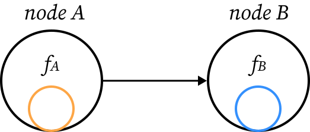
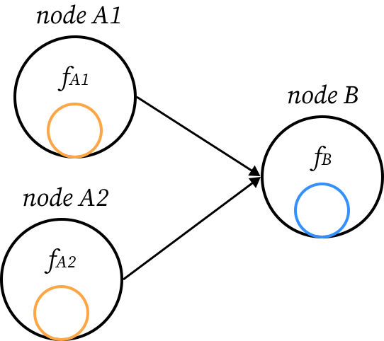
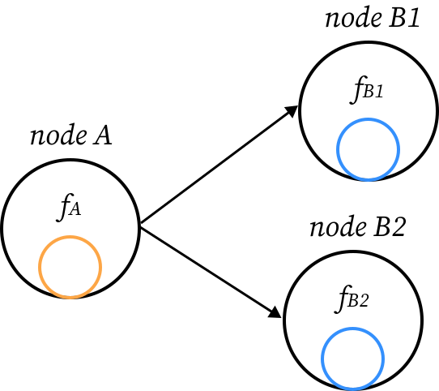
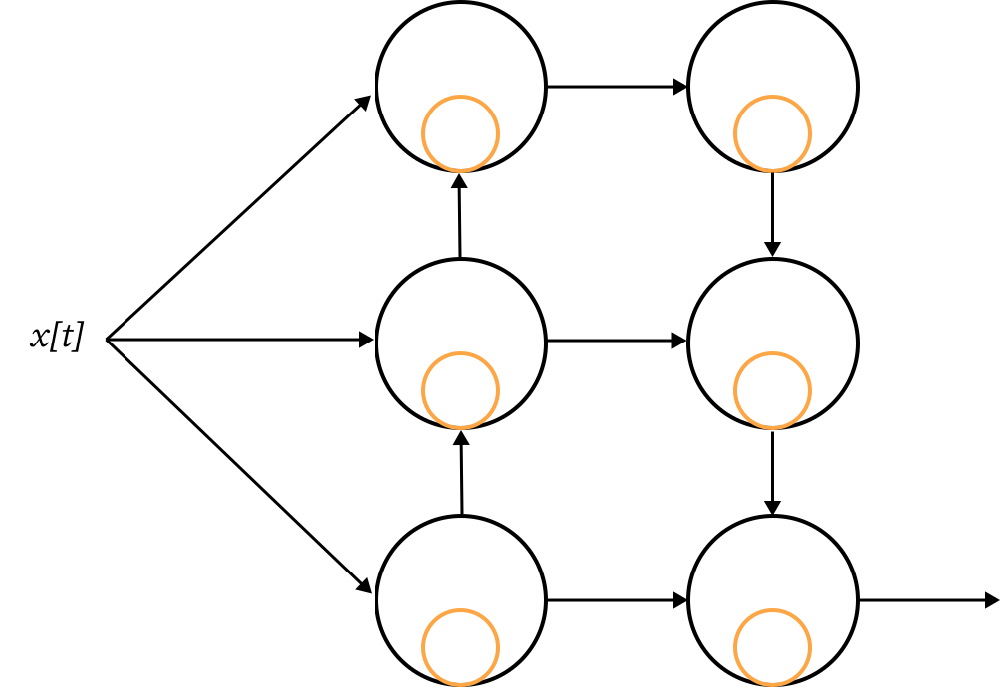

.. _model:

{{ header }}

====================
From Nodes to Models
====================

While the :py:class:`~.Node` class alone provides tools to define recurrently defined functions, such as the equations
of recurrent neural networks, most users will need to combine nodes together to build powerful models.

Now that you have learned more about nodes in ReservoirPy in the :ref:`node` guide, read this guide to understand how
to combine nodes within complex computational graphs, using the :py:class:`~.Model` class.

Definition
----------

Models are object storing nodes and relations between them, to allow **functional composition**. Nodes combined within
a :py:class:`~.Model` instance will combine their forward function into one complex forward function :math:`F`. A Model
forward function :math:`F` can therefore be seen as a specific composition of all nodes forward functions within it,
used to update all nodes internal states at once :eq:`model_forward`:

.. math::
   :label: model_forward

    S[t+1] &= F(S[t], x[t]) \\
           &= f_n(s_n[t], \dots f_2(s_2[t], f_1(s_1[t], x[t]))) \\
           &= (f_n \circ \dots \circ f_2 \circ f_1)(\{s_n[t], \dots, s_2[t], s_1[t]\}, x[t])

where :math:`S` is the set of all internal states of the :math:`n` nodes in the :py:class:`~.Model`, and the
:math:`f_n, \dots, f_2, f_1` are the forward functions of these nodes.

We can represent this model as a *computational graph*, where composition of forward functions is represented as an
edge in the graph. For instance, if node A is equiped with function :math:`f_A`, and node B with function :math:`f_B`,
then :math:`(f_B \circ f_A)(s_A[t], s_B[t], x[t]) = f_B(s_B[t], f_A(s_A[t], x[t]))`
can be represented as the graph in :numref:`ABgraph`.

.. _ABgraph:

    A graph connecting node A to node B. In that case, appliying the model on some data point :math:`x[t]` will
    first update the internal state of node A using function :math:`f_A` on :math:`x[t]`, before updating the internal
    state of node B using function :math:`f_B` on A's internal state. This is equivalent to compose :math:`f_A` with
    :math:`f_B`.

Create a :py:class:`~.Model`
----------------------------

To define a :py:class:`~.Model`, the simplest way is to use the ``>>`` operator on some nodes:

.. code-block:: python

    model = nodeA >> nodeB

This wille create a very simple model storing the graph in :numref:`ABgraph`.

The ``>>`` operation between models uses the function :py:func:`~.link` of ReservoirPy. You can either use the function
or the ``>>`` operator to define models:

.. code-block:: python

    from reservoirpy import link

    model = link(nodeA, nodeB)

As Models are essentially a subclass of :py:class:`~.Node`, it is also possible to link models together, or nodes to
models. This allow to chain the ``>>`` operator:

.. code-block:: python

    model = nodeA >> nodeB >> nodeC

This model forward function :math:`F` is defined as :math:`f_C \circ f_B \circ f_A`.

Call and run a Model
--------------------

Models display the same interface as nodes. They can be called on some data points, or on a timeseries using the
:py:meth:`~.Model.run` method. Consider the very simple model defined by:

.. code-block:: python

    model = nodeA >> nodeB

We can call or run this model:

.. code-block:: python

    # using 'call' on a single timestep of data x_t0
    s_t1 = model.call(x_t0)
    # using model as a function
    s_t1 = model(x_t0)
    # running on a sequence X
    S = model.run(X)

In that case, the variable ``s_t1`` (or ``S`` when using :py:meth:`~.Model.run`)
stores the internal state of the model output node. Taking the model in
:numref:`ABgraph` as example, the variable would contain the state of node B, as it is the last one to be visited
in the graph.

These operations update the states of all nodes within the graph. It is still possible to access these updated states
using the node instances:

.. code-block:: python

    s_t1 = model.call(x_t0)
    # now that we have called the model, nodeB is updated
    assert np.all(nodeB.state() == s_t1)

Access nodes attributes
-----------------------

A list of all nodes in the model can be retrieved using the :py:attr:`Model.nodes` attribute. You can also retrieve
them using their names (see :ref:`naming_nodes`) with the method :py:meth:`~.Model.get_node`:

.. code-block:: python

    nodeA = Node(..., name="A")
    nodeB = Node(..., name="B")
    model = nodeA >> nodeB
    assert id(model.get_node("A")) == id(nodeA)

Nodes parameters and hyperparameters can be accessed this way inside a model. They are also stored in the
:py:attr:`Model.params` and :py:attr:`Model.hypers` attributes, using nested dictionaries:

.. code-block:: python

    assert model.params["A"]["param1"] == nodeA.param1

An example: building a simple Echo State Network
------------------------------------------------

Models allow us to create our first Echo State Network (ESN), a well-known neural network architecture within the
Reservoir Computing field. An ESN is made of a *reservoir*, a recurrent neural network made of randomly
connected neurons, and a *readout*, a simple feed-forward neural network connected to the reservoir. Connections between
the reservoir and the readout layer of neurons can be learned (see :ref:`learning_rules` to learn how to train an ESN).
For now, these connections are kept constant.

In ReservoirPy, a reservoir can be built using a :py:class:`~.Reservoir` node. A readout equiped with a simple linear
regression mechanism for connection weight learning can be created using the :py:class:`~.Ridge` node. We start with
creating a readout and a reservoir node. The reservoir contains 100 neurons, while the readout is a layer of only
one neuron.

.. ipython:: python

    from reservoirpy.nodes import Reservoir, Ridge

    reservoir = Reservoir(100)
    readout = Ridge(1)

Next, we can link these two nodes together to create our first ESN:

.. ipython:: python

    esn = reservoir >> readout

This ESN can then be called and run over timeseries.

.. ipython:: python

    X = np.sin(np.arange(0, 10))[:, np.newaxis]
    S = esn.run(X)
    print(S)

Because we have not trained the connections between the readout and the reservoir yet, the output is just a null vector.
You can see :ref:`learning_rules` to learn more about how to train these connections to perform task on some data.

Multi inputs models
-------------------

In some cases, models need to be connected to different source of data simultaneously, or to output several values.
For instance, imagine that we need node B to receive two different inputs from node A1 and node A2 (:numref:`AABgraph`):

.. _AABgraph:

    A graph connecting node A1 and node A2 to node B.

To create this graph, we can apply ``>>`` on a list of nodes:

.. code-block:: python

    model = [nodeA1, nodeA2] >> nodeB

This model will give inputs to node A1 and node A2, concatenate their internal states and give the concatenated states
to node B.

.. note::

    Concatenation of A1 and A2 states will be handled by a :py:class:`~.Concat` node. This node will be automatically inserted
    between nodes A1, A2 and B in that case.

To run this model, we can either give a single data point that will be used by both A1 and A2, or give
different inputs to each nodes in the call or run method using a dictionnary. In this dictionnary, the key must be
the name of a model input node, and the value a data point (or a timeseries) to give to these input nodes:

.. code-block::

    # same input for A1 and A2
    s = model(x)
    # different inputs for A1 and A2
    s = model({"A1": x1, "A2": x2})

.. note::

    Naming your nodes will help you doing this. We consider above that the nodes have been named "A1", "A2" and "B" at
    instanciation.

Multi outputs models
--------------------

Similarly, imagine that we need node A to be connected to both node B1 and node B2 (:numref:`ABBgraph:`):

.. _ABBgraph:

    A graph connecting node A to node B1 and node B2.

We can still use ``>>`` and a list of nodes:

.. code-block:: python

    model = nodeA >> [nodeB1, nodeB2]

This model will give inputs to node A, and then give A's internal state to node B1 and node B2.

In that case, when calling or running the model, output internal states will be a dictionnary. In this dictionnary,
the keys will be the names of model's output nodes, and the values their respective internal states:

.. code-block:: python

    s = model(x)
    assert s["B1"] == nodeB1.state()
    assert s["B2"] == nodeB2.state()

.. note::

    Naming your nodes will help you doing this. We consider above that the nodes have been named "A", "B1" and "B2" at
    instanciation.

Merge models and build complex graphs
-------------------------------------

Models can display any level of complexity. While most reservoir computing models can be seen as a simple chain of
operations, as it is the case in an ESN, some models, like *deep echo state networks*,
require to combine nodes in more elaborate ways.

Imagine now that we want to create the model defined by the complicated graph in :numref:`compgraph`:

.. _compgraph:

    A complicated model.

To create this model, we must decompose it into several path of connections between nodes, or several sub-models. All
sub-models can then be merged using the ``&`` operator, or the :py:func:`~.merge` function.

First, let's connect inputs
to nodes A, B and C. To do this, we can use the :py:class:`~.Input` node to indicate to the model where inputs should be
fed.

.. code-block::

    path1 = Input() >> [A, B, C]

Now, we can create the big loop of connections going from node A to node F. To ensure that only node F will be used as
output to the Model, we can use the :py:class:`~.Output` node.

.. code-block::

    path2 = A >> B >> C >> D >> E >> F >> Output()

Only two more connections to create! We can now connect A to F and B to E:

.. code-block::

    path3 = A >> F
    path4 = B >> E

To create the final model, we will use the :py:func:`~.merge` function, triggered by the ``&`` operator between models.
This operation will gather all nodes and connections defined in all models named ``path#`` into one single model.

.. code-block::

    model = path1 & path2 & path3 & path4
    # or using "merge"
    from reservoirpy import merge
    model = merge(path1, path2, path3, path4)

``model`` variable now contains all nodes and all connections defined in the graph in :numref:`compgraph`.

Learn more
----------

Now that you are more familiar with the basic concepts of models, you can see:

- :ref:`learning_rules` on how to make your nodes and models learn from data,

- :ref:`feedback` on how to create feedback connections between your nodes,

- :ref:`create_new_node` on how to create your own nodes, equipped with custom functions and learning rules.

References
----------

    ReservoirPy Node API was heavily inspired by Explosion.ai *Thinc*
    functional deep learning library [1]_, and *Nengo* core API [2]_.
    It also follows some *scikit-learn* schemes and guidelines [3]_.

    .. [1] `Thinc <https://thinc.ai/>`_ website
    .. [2] `Nengo <https://www.nengo.ai/>`_ website
    .. [3] `scikit-learn <https://scikit-learn.org/stable/>`_ website
