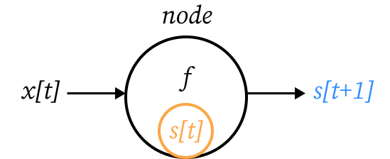
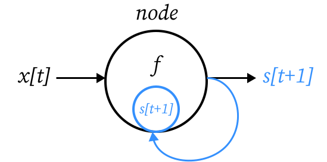
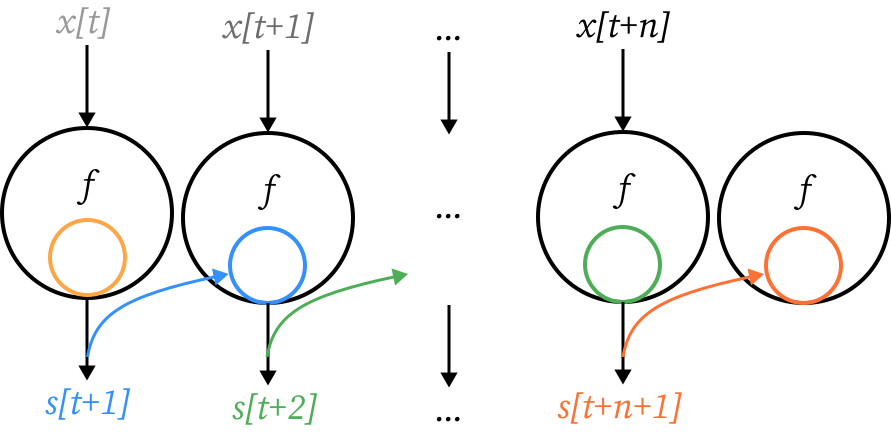
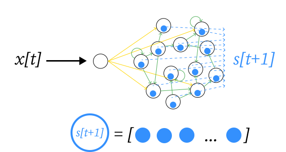

.. _node:

===================
Node functional API
===================

{{ header }}

The Node API features a simple implementation of computational graphs to develop complex reservoir computing
architectures, similar to what can be found in other popular deep learning and differentiable calculus
libraries. It is however simplified and made the most flexible possible by
discarding the useless "fully differentiable operations" functionalities. If
you wish to use learning rules making use of chain rule and full
differentiability of all operators (stochastic gradient descent, for instance),
ReservoirPy may not be the tool you need
(actually, the whole paradigm of reservoir computing might arguably not be the
tool you need).

What is a Node?
----------------

In ReservoirPy, all operations are Nodes. For instance, imagine you want to build an Echo State Network (ESN). An
ESN is made of a *reservoir*, a pool of randomly connected neurons with recurrent connexions, and a *readout*, a
layer of linear neurons connected with the neurons of the reservoir. The readout connections are moreover equipped with
a learning rule such as ridge regression.

To define an ESN in ReservoirPy, we therefore need to connect
two nodes in a graph: a :py:class:`~.Reservoir` node and a :py:class:`~.Ridge` node. The graph defines that the reservoir
internal states must be given as input to the readout.

These two nodes give access to all characteristics of the reservoir and the readout we define for the task: their
parameters, their hyperparameters, their states, their functions, and so on.

In the following guide, you will learn more about how to work with :py:class:`~.Node` objects. If you want to learn more
about how to define computational graphs of nodes, you can read :ref:`model`.

What is a Node, really?
------------------------

In a computational graph, each operation is represented by a :py:class:`~.Node`. A node is able
to apply the operation it holds on any data reaching it through all the connections with other nodes in the
graph. Within ReservoirPy, we define a Node as a simple object holding a function and an internal state
(:numref:`node_t0`):

.. _node_t0:

    The most simple schema of a :py:class:`~.Node`.

Here, a node is given a function :math:`f`, called a **forward function**,
and an **internal state** :math:`s[t]`. Notice how this state depends
on a mysterious variable :math:`t`. Well, this is just a discrete representation of time. Indeed, all operations in
ReservoirPy are **recurrent**: the forward function :math:`f` is always applied on some data and
on its own previous results, stored in the state :math:`s` (:numref:`node_t1_out`).

To summarize, a node performs operations that can be mathematically expressed as :eq:`rec_node`:

.. math::
    :label: rec_node

    s[t+1] = f(s[t], x[t])

where :math:`x[t]` represents some input data arriving to the node at time :math:`t`.

.. _node_t1_out:

    A :py:class:`~.Node` is used to executes the forward function :math:`f`, which computes its next state
    :math:`s[t+1]` given the current state of the Node :math:`s[t]` and some input data :math:`x[t]`.

Accessing state
---------------

In ReservoirPy, a node internal state is accessible through the :py:meth:`~.Node.state` method:

.. code-block:: python

    s_t0 = node.state()

The state is always a :py:class:`~.numpy.ndarray` vector, of shape ``(1, ndim)``, where ``ndim`` is the dimension of the
node internal state.

To learn how to modify or initialize a node state, see :ref:`/user_guide/quickstart.ipynb#Reset-or-modify-reservoir-state`.

Applying node function and updating state
-----------------------------------------

And to apply the forward function :math:`f` to some input data, one can simply use the :py:meth:`~.Node.call` method of a
node, or directory call the node on some data:

.. code-block:: python

    # using 'call'
    s_t1 = node.call(x_t0)
    # using node as a function
    s_t1 = node(x_t0)

This operation automatically triggers the update of the node internal state (:numref:`node_t1_update`):

.. code-block:: python

    # node internal state have been updated from s_t0 to s_t1
    assert node.state() == s_t1

To learn how to modify this automatic update, see :ref:`/user_guide/quickstart.ipynb#Reset-or-modify-reservoir-state`.

.. _node_t1_update:

    Calling a :py:class:`~.Node` returns next state value :math:`s[t+1]` and updates the node internal state with this new value.

Parametrized nodes
------------------

It is also possible to hold parameters in a node, to change the behaviour of :math:`f`. In this case, :math:`f` becomes
a parametrized function :math:`f_{p, h}`. The parameters :math:`p` and :math:`h` are used by the function to modify its
effect. They can be, for instance, the synaptic weights of a neural network, or a learning rate coefficient.
If these parameters evolve in time, through learning for instance, they should be stored in :math:`p`.
We call them **parameters**.
If these parameters can not change, like a fixed learning rate, they should be stored in :math:`h`.
We call them **hyperparameters**.

.. figure:: ../_static/user_guide/node/node_t0_params.svg
    :align: center
    :width: 100px
    :alt: A Node can also hold parameters and hyperparameters.

    A :py:class:`~.Node` can also hold parameters and hyperparameter to parametrize :math:`f`.

A node can therefore be more generally described as :eq:`rec_node_params`:

.. math::
    :label: rec_node_params

    s[t+1] = f_{p,h}(s[t], x[t]) = f(s[t], x[t], p, h)

Parameters and hyperparameters of the node can be accessed through the :py:attr:`Node.params` and :py:attr:`Node.hypers`
attributes:

.. ipython::
    :verbatim:

    In [1]: node.params
    Out [1]: {"param1": [[0]], "param2": [[1, 2, 3]]}

    In [2]: node.hypers
    Out [2]: {"hyper1": 1.0, "hyper2": "foo"}

They can also directly be accessed as attributes:

.. ipython::
    :verbatim:

    In [3]: node.param2
    Out [3]: [[1, 2, 3]]

    In [4]: node.hyper1
    Out [4]: 1.0

.. _naming_nodes:

Naming nodes
------------

Nodes can be named at instantiation.

.. code-block:: python

    node = Node(..., name="my-node")

Naming your nodes is a good practice, especially when working with complex models involving a lot of different nodes.

.. warning::
    All nodes created should have a unique name. If two nodes have the same name within your environment, an exception will
    be raised.

Be default, nodes are named ``Class-#``, where ``Class`` is the type of the node and ``#`` is the unique number
associated with this instance of ``Class``.

Running nodes on timeseries or sequences
----------------------------------------

Reservoir Computing is usually applied to problems where timing of data carries relevant information. This kind of data
is called a timeseries. As all nodes in ReservoirPy are recurrently defined, it is possible to update a node state
using a timeseries as input instead of one time step at a time. The node function will then be called on each time
steps of the timeseries, and the node state will be updated accordingly (:numref:`run_node`):

.. _run_node:

    A :py:class:`~.Node` can apply its function on some timeseries while updating its state at every time step.

To apply a :py:class:`~.Node` on a timeseries, you can use the :py:meth:`~.Node.run` method:

.. code-block::

    # X = [x[t], x[t+1], ... x[t+n]]
    states = node.run(X)
    # states = [s[t+1], s[t+2], ..., s[t+n+1]]

An example using :py:class:`~.Reservoir` node
---------------------------------------------

Let's use the :py:class:`~.Reservoir` class as an example of node. :py:class:`~.Reservoir` class is one of the cornerstone
of reservoir computing tools in ReservoirPy. It models a pool of leaky integrator rate neurons,
sparsely connected together. All connections within the pool are random, and neurons can be connected to themselves.
The forward function of a Reservoir node can be seen in equation :eq:`res_equation`.

.. math::
   :label: res_equation

    s[n+1] = (1 - lr) \cdot s[t] + \alpha \cdot f(W_{in} \cdot x[n] + W \cdot s[t])

Internal state of the reservoir :math:`s[t]` is in that case a vector containing the activations of all neurons
at timestep :math:`t`. The forward function is parametrized by an hyperparameter :math:`lr` (called *leaking rate*)
and two matrices of parameters :math:`W` and :math:`W_{in}`, storing the synaptic weights of all neuronal connections.
Connections stored in :math:`W` are represented using |warrow| in figure :numref:`res_t0`, and connections stored in
:math:`W_{in}` are represented using |winarrow|.

.. _res_t0:
.. figure:: ../_static/user_guide/node/res_t0.svg
    :align: center
    :width: 400px
    :alt: A reservoir node.

    A :py:class:`~.Reservoir`. Internal state of the node is a vector containing activations of all neurons in the
    reservoir.

To instantiate a :py:class:`~.Reservoir`, only the number of units within it is required. Leaking rate will have in that
case a default value of 1, and :math:`W` and :math:`W_{in}` will be randomly initialized with a 80% sparsity.

.. ipython:: python

    from reservoirpy.nodes import Reservoir

    nb_units = 100  # 100 neurons in the reservoir
    reservoir = Reservoir(nb_units)

Parameters and hyperparameters are accessible as attributes:

.. ipython:: python

    print(reservoir.lr)  # leaking rate

Now, let's call the reservoir on some data point :math:`x[t]`, to update its internal state, initialized to
a null vector. We first create some dummy timeseries ``X``:

.. ipython:: python

    X = np.sin(np.arange(0, 10))[:, np.newaxis]

Notice that all nodes require data to be 2-dimensional arrays, with first axis representing time and second axis
representing features. We can now call the reservoir on some data, to update its internal state as shown below.
Reservoir state is accessible using its :py:meth:`~.Reservoir.state` method.

.. ipython:: python

    s_t1 = reservoir(X[0])
    assert np.all(s_t1 == reservoir.state())

.. _res_t1:

    A :py:class:`~.Reservoir` is called on some data point :math:`x[t]`, which activates the pool of neurons to update
    their state according to equation :eq:`res_equation`.

We can also retrieve all activations of the reservoir on the full timeseries, using :py:meth:`~.Reservoir.run`:

.. ipython:: python

    S = reservoir.run(X)

The plot below shows these activations for 5 neurons in the reservoir, over the entire timeseries:

.. plot::

    from reservoirpy.nodes import Reservoir
    res = Reservoir(100)
    X = np.sin(np.arange(0, 10))[:, np.newaxis]
    S = res.run(X)
    ticks = []
    tick_labels = []
    for i in range(5):
        plt.plot(S[:, i]+(i*4))
        ticks += [i*4-1, i*4, i*4+1]
        tick_labels += [-1, 0, 1]
    plt.yticks(ticks, tick_labels)
    plt.title("Internal states of 5 neurons in the reservoir")
    plt.ylabel("$S[t]$")
    plt.xlabel("Timestep $t$")
    plt.show()

Learn more
----------

Now that you are more familiar with the basic concepts of the Node API, you can see:

- :ref:`model` on how to connect nodes together to create :py:class:`~.Model` objects,

- :ref:`learning_rules` on how to make your nodes and models learn from data,

- :ref:`/user_guide/advanced_demo.ipynb#Feedback-connections` on how to create feedback connections between your nodes,

- :ref:`create_new_node` on how to create your own nodes, equipped with custom functions and learning rules.

References
----------

    ReservoirPy Node API was heavily inspired by Explosion.ai *Thinc*
    functional deep learning library [1]_, and *Nengo* core API [2]_.
    It also follows some *scikit-learn* schemes and guidelines [3]_.

    .. [1] `Thinc <https://thinc.ai/>`_ website
    .. [2] `Nengo <https://www.nengo.ai/>`_ website
    .. [3] `scikit-learn <https://scikit-learn.org/stable/>`_ website
